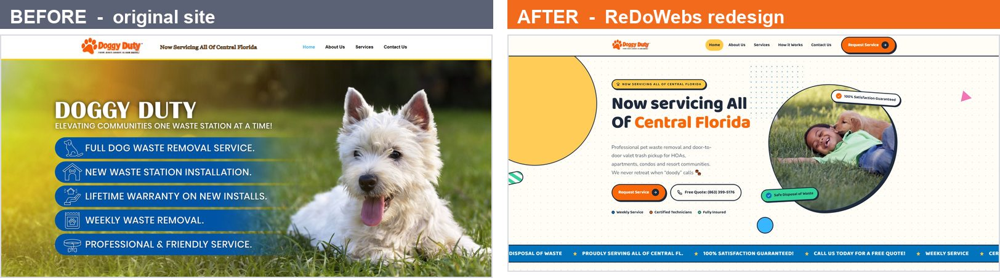
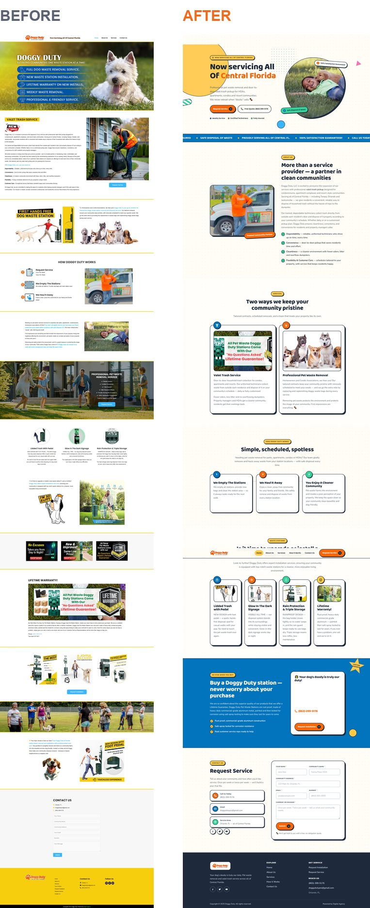
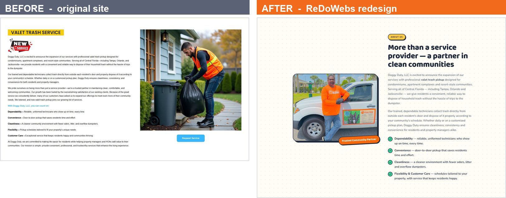
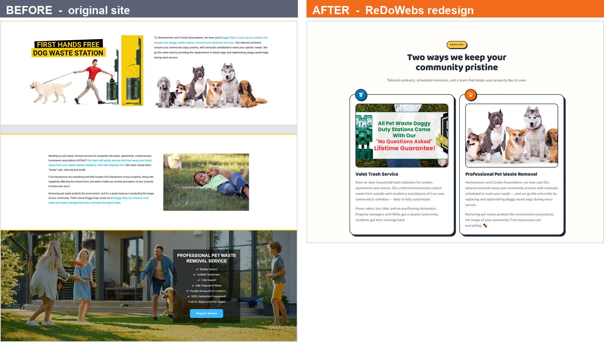
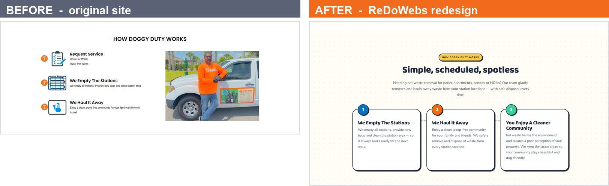
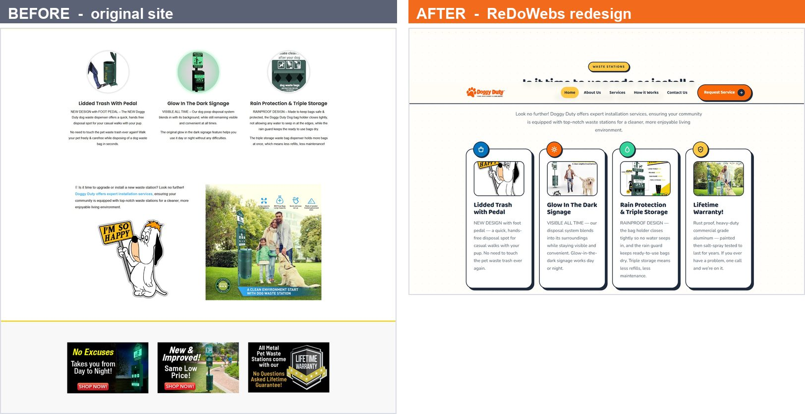
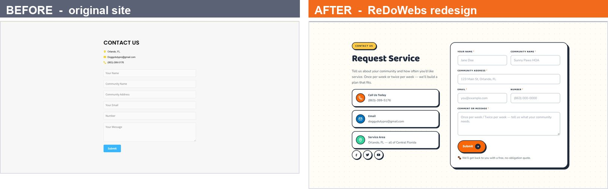
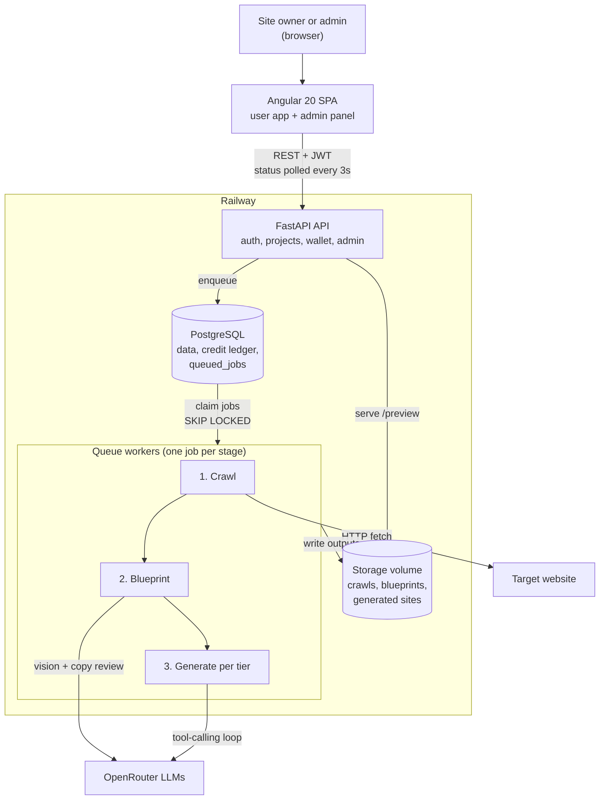

# ReDoWebs

**AI-powered website modernization.** Paste the URL of an outdated small website and get back modern, responsive redesigns that keep the original content, brand and business details.

ReDoWebs crawls the site (up to 20 pages), turns it into a structured JSON blueprint, and runs an agentic LLM loop that writes a fresh HTML/CSS site for each quality tier. Users preview every tier for free and spend credits to download the source.



---

## Showcase: doggyduty.pet

A real small-business site, [doggyduty.pet](https://doggyduty.pet), redesigned by ReDoWebs. Both pages were captured at 1900 px width. The redesign carries the same services, products, warranty and contact details in a page that is **18% shorter** (10,780 px to 8,859 px).

<table>
<tr>
<td width="38%" valign="top">

</td>
<td valign="top">

**What changed**

- **Structure:** 13 content blocks split by yellow dividers became 7 clearly labelled sections, each with a headline and short intro.
- **First screen:** the original hero has no button; the redesign puts Request Service and a free-quote phone button above the fold.
- **Copy:** six dense paragraphs tightened to two, and the benefits turned into a checklist.
- **Visual system:** the brand's orange and yellow carried into rounded cards, icons, badges and one button style.
- **Forms:** visible labels, required markers, example placeholders and a reassurance line under Submit.

**What was kept**

Services, product features, the lifetime warranty, phone, email and the Central Florida service area all appear in the redesign, which reuses the site's own photos and graphics. The pipeline is built so it never invents testimonials, prices, stats or contact details.

</td>
</tr>
</table>

<details>
<summary><b>Section-by-section comparison</b></summary>

#### About


#### Services
The original split its services across two parts of the page (stacked on the left). The redesign merges them into one section of cards.


#### How it works


#### Waste stations


#### Contact


</details>

The full write-up with notes on every section is in [docs/portfolio/doggyduty-before-after.pdf](docs/portfolio/doggyduty-before-after.pdf).

---

## How it works

1. **Submit.** The user pastes a URL and accepts the terms. Sites over 20 pages are rejected, not truncated.
2. **Crawl.** The crawler fetches pages and assets, respecting `robots.txt`.
3. **Blueprint.** A deterministic extractor maps each page into a 14-section JSON schema. A vision call reads the logo, fonts and tone, and a text call polishes marketing copy. Code-level merge rules block the model from inventing factual claims.
4. **Generate.** One job per enabled tier. Each runs an agent loop with sandboxed `write_file`, `read_file` and `list_files` tools, then a post-processing pass adds alt text, Open Graph tags, a sitemap and WCAG contrast checks.
5. **Preview and download.** The frontend polls status every 3 s and shows each tier in an iframe. On first download of a multi-page site, the remaining pages are generated in the same style.

## Architecture



Postgres holds both app data and the job queue, so the backend needs no Redis or message broker.

## Engineering highlights

- **Agentic site generation.** A hand-rolled tool-calling loop over OpenRouter's OpenAI-compatible API builds a multi-file site step by step instead of in one completion.
- **Anti-fabrication blueprint.** Optional sections (testimonials, pricing, team, stats, credentials, contact) stay empty if the source lacks them. This is enforced in code and covered by tests with adversarial fake LLM responses.
- **Dynamic tiers.** Tiers are admin-managed rows with their own price and model override. The pipeline fans out one job per enabled tier, and each succeeds or fails on its own.
- **Postgres job queue.** Celery and Redis were replaced with a `queued_jobs` table claimed via `SELECT … FOR UPDATE SKIP LOCKED`, so several workers can run in parallel.
- **Ledger-based credit wallet.** An append-only transaction ledger is the source of truth, with row locking and idempotency keys for concurrent spends.
- **Style-locked full-site unlock.** Previews cover only the home page to keep AI cost low. The remaining pages are generated on first download, with the approved home page made unwritable and the stylesheet append-only.
- **Admin panel.** Per-job token and cost analytics, user wallets and manual credit adjustments, model pricing, and prompt-template upload and toggling.

## Tech stack

| Layer | Technologies |
| --- | --- |
| Frontend | Angular 20 (standalone components), TypeScript 5.9, RxJS, Tailwind CSS v4 |
| Backend API | Python, FastAPI, Pydantic v2, Uvicorn, slowapi |
| Data | PostgreSQL, SQLAlchemy 2.0, Alembic, psycopg 3 |
| Background jobs | Custom Postgres-backed queue, multi-worker |
| Crawling | httpx, requests, BeautifulSoup, lxml, Pillow |
| AI | OpenRouter, vision and text LLMs, agentic tool calling |
| Generated sites | Semantic HTML5, Tailwind or Bootstrap via CDN, OG tags, sitemap.xml |
| Auth | Google SSO, JWT, role-gated admin API |
| Infrastructure | Docker, Docker Compose, Railway, cPanel |
| Testing | pytest |

## Repository layout

```
backend/      FastAPI app, queue worker, AI pipeline, prompts, Alembic migrations, tests
frontend/     Angular 20 app (user flow + admin panel)
standalone/   Docker Compose files (local Postgres, backend containers)
docs/         PRD, implementation plan, progress, install and deployment guides
```

## Getting started

You need Docker, Python 3.12, Node.js and an [OpenRouter](https://openrouter.ai) API key. Full details are in [docs/INSTALLATION.md](docs/INSTALLATION.md).

```bash
# 1. Database
cd standalone
docker compose up -d

# 2. Backend
cd ../backend
python -m venv venv
source venv/bin/activate          # Windows: .\venv\Scripts\Activate.ps1
pip install -r requirements.txt
cp .env.example .env              # add REDOWEBS_OPENROUTER_API_KEY, Google OAuth and JWT secret
python -m alembic upgrade head
python -m uvicorn app.main:app --port 8123

# 3. Queue worker (separate terminal)
python -m app.workers.queue_worker

# 4. Frontend (separate terminal)
cd ../frontend
npm install
npm start                         # http://localhost:4200
```

Run the backend tests with `python -m pytest` from `backend/`. To make a user an admin, run `python -m scripts.promote_admin you@example.com`.

## Documentation

| Doc | What it covers |
| --- | --- |
| [PRD](docs/PRD.md) | Problem, users, scope and requirements |
| [Implementation plan](docs/implementation-plan.md) | Stack, schema, API, pipeline design, milestones |
| [Progress](docs/PROGRESS.md) | Build status against the milestones |
| [Installation](docs/INSTALLATION.md) | Local setup, step by step |
| [Docker](docs/DOCKER.md) | Containerized backend |
| [Railway](docs/RAILWAY.md) | Production deployment |
| [Blueprint pipeline](docs/blueprint-json-pipeline-plan.md) | Structured JSON blueprint design |

## Status

The core crawl, blueprint and generate pipeline, Google sign-in, the credit wallet, the admin panel and the Railway deployment are working. Stripe credit-pack checkout and email/password sign-up are planned but not built yet; see [docs/PROGRESS.md](docs/PROGRESS.md).
